<div align="center">
  
  <h2>Frappe Mail</h2>
</div>

Frappe Mail is an open-source email platform built on the [Frappe Framework](https://github.com/frappe/frappe), designed to streamline end-to-end email management. It’s organized into three core components [Client](https://github.com/frappe/mail_client), [Server](https://github.com/frappe/mail_server), and [Agent](https://github.com/frappe/mail_agent). The Client generates email messages and passes them to the Server for processing. The Server handles essential validations, such as checking user quotas, enforcing limits, and running spam checks. If all checks are cleared, the email is pushed to [RabbitMQ](https://github.com/rabbitmq/rabbitmq-server). The Agent then takes over, with multiple agents available to consume emails from the queue and deliver them through a locally connected [Haraka MTA](https://github.com/haraka/haraka) instance. With simple APIs, Frappe Mail makes it easy to integrate reliable email functionality into your applications.

> Note: Frappe Mail Client is designed to work exclusively with the Frappe Mail Server and is not compatible with traditional email servers.

## Table of Contents

- [Installation](#installation)
- [Connecting to the Mail Server](#connecting-to-the-mail-server)
- [Adding a Mail Domain](#adding-a-mail-domain)
- [Adding a Mailbox](#adding-a-mailbox)
- [Sending Your First Email](#sending-your-first-email)
- [Outbound Reports](#outbound-reports)
- [Receiving Emails](#receiving-emails)
- [Mail Aliases](#mail-aliases)
- [APIs](#apis)
  - [Auth](#1-auth-api)
  - [Outbound](#2-outbound-api)
  - [Inbound](#3-inbound-api)
- [Frontend UI](#frontend-ui)
- [Contributing](#contributing)
- [License](#license)

## Installation

You can install this app using the [bench](https://github.com/frappe/bench) CLI:

1. Install Frappe Mail Client:

   ```bash
   bench get-app mail_client
   ```

2. Create a site with the `mail_client` app:

   ```bash
   bench --site sitename.localhost install-app mail_client
   ```

3. Open the site in the browser:

   ```bash
   bench browse sitename.localhost --user Administrator
   ```

## Connecting to the Mail Server

1. **Open Mail Client Settings:** In the Frappe Mail Client, navigate to **Mail Client Settings** to configure the connection to your Mail Server.

2. **Add Mail Server Details:** Enter the following details:

   - **Mail Server:** Specify the URL or IP address of the Frappe Mail Server.
   - **API Key and API Secret:** Provide the API credentials generated on the Mail Server. These are used to authenticate and secure the connection between the Client and Server.

3. **Save and Validate:** After entering the details, click Save. The credentials will be automatically validated. If there are any issues, an error message will appear to help you troubleshoot the configuration.

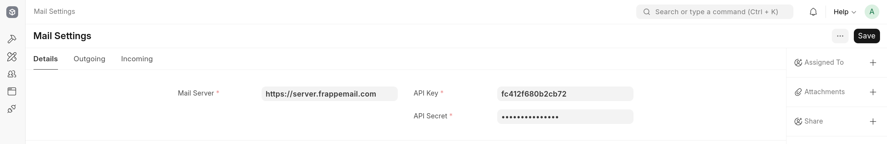

## Adding a Mail Domain

To send and receive emails with your Frappe Mail Client, you'll need to add a Mail Domain. Here are the steps to do that:

1. **Navigate to Mail Domains:** Go to the Mail Domain in your Frappe Mail Client to add a Mail Domain.

2. **Enter Domain Name:** In the field provided, input your desired domain name (e.g., frappemail.com).
   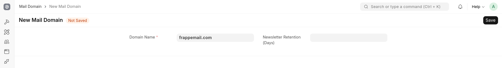

3. **Save the Domain:** Click Save to register the domain. After saving, you will see the necessary DNS records that need to be added to your domain registrar (like Namecheap, GoDaddy, or Cloudflare).
   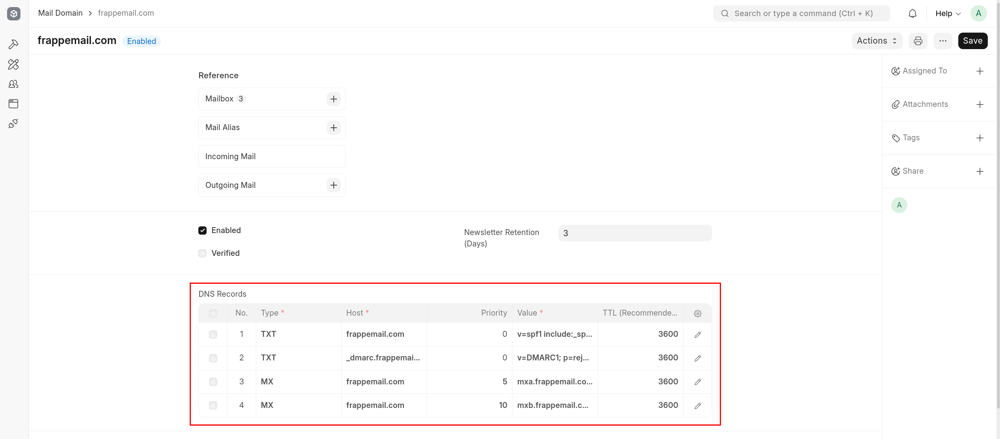

4. **Add DNS Records:** Go to your domain registrar’s DNS management panel and add the provided DNS records. These typically include SPF, DMARC and MX records for proper email delivery.

5. **Verify the Mail Domain:** Once you’ve added the DNS records, return to the Mail Domain. Click on Actions and then select Verify DNS Records.

   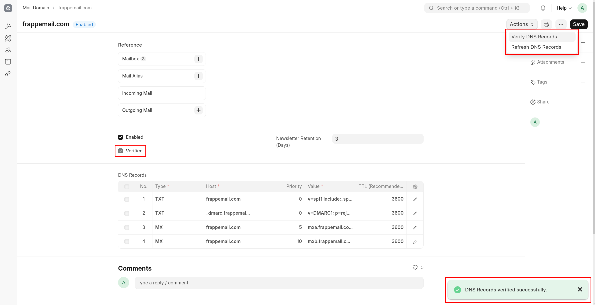

   A notification will appear showing the verification results. If all the DNS records match, the verified checkbox will automatically be checked, indicating that your domain is set up correctly.

   > **Note:** Please note that DNS verification may take some time to complete because of the TTL (Time to Live) settings on your DNS records. Changes to DNS records may not propagate immediately due to caching by DNS servers.

6. **Repeat:** To add additional domains, simply repeat the process for each new domain you want to add.

By following these steps, your mail domain will be successfully added and verified, enabling you to send and receive emails through your Frappe Mail setup.

## Adding a Mailbox

To set up a new mailbox for your users, follow these steps:

1. **Navigate to Mailboxes:** Go to the Mailbox in your Frappe Mail Client to add a new Mailbox.

2. **Select Domain Name:** From the dropdown, choose the domain name under which you want to create the mailbox.

3. **Select User:** Choose the user who will be assigned this mailbox. Ensure that the user has the **Mailbox User** role assigned.

4. **Enter Email Address:** In the provided field, enter the email address that belongs to your selected domain (e.g., sagar.s@frappemail.com).

5. **Save the Mailbox:** Click Save to create the mailbox.

   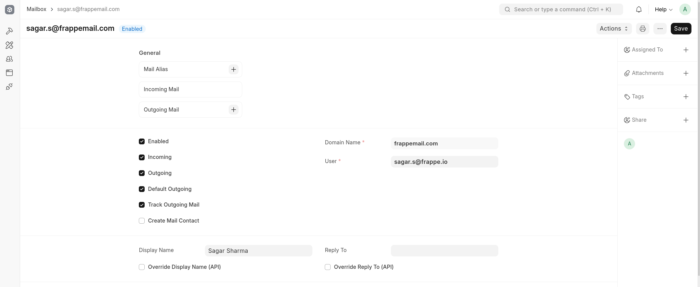

6. **Repeat:** To add additional mailboxes, simply repeat the process for each new mailbox you want to create.

By following these steps, you will successfully add a mailbox for the specified user, enabling them to send and receive emails through your Frappe Mail setup.

## Sending Your First Email

To send your first email, follow these steps:

1. **Access Outgoing Mail:** Navigate to the Outgoing Mail in the Frappe Mail Client and create a new outgoing email.

2. **Select Sender Mailbox:** If you’re associated with multiple mailboxes, choose the mailbox you want to send the email from.

3. **Compose Your Email:** Enter the subject, recipients, and body of your email.

4. **Save and Submit:** Click Save to store your email, then submit it. The status will change to Pending, indicating that the outgoing email is awaiting processing.

5. **Transfer the Email:** The email will be picked up by a scheduled job to transfer it to the Mail Server. Alternatively, you can use the **Actions > Transfer Now** option to prioritize sending the email immediately.

   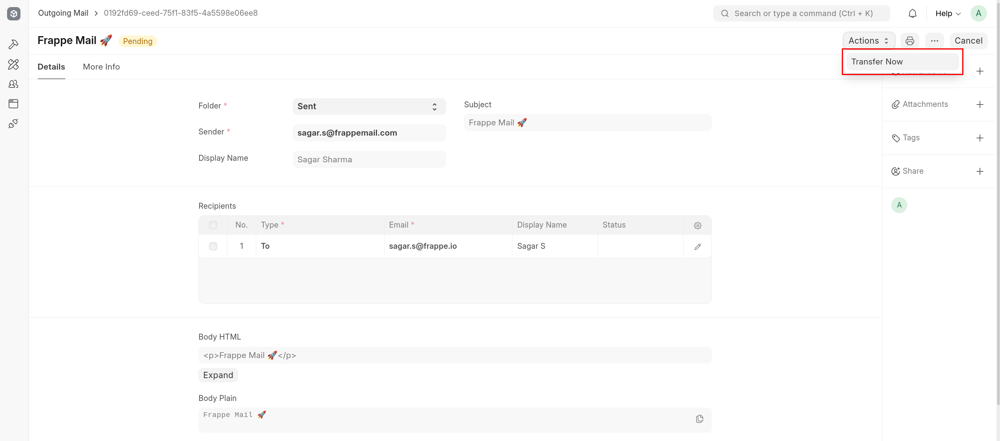

6. **Email Processing:** Once transferred to the Mail Server, the status changes to Queued. The Mail Server will then process your email, performing a spam check. If flagged as spam, the email will be blocked. Otherwise, it will be sent to the recipients, and the status will be updated accordingly.

   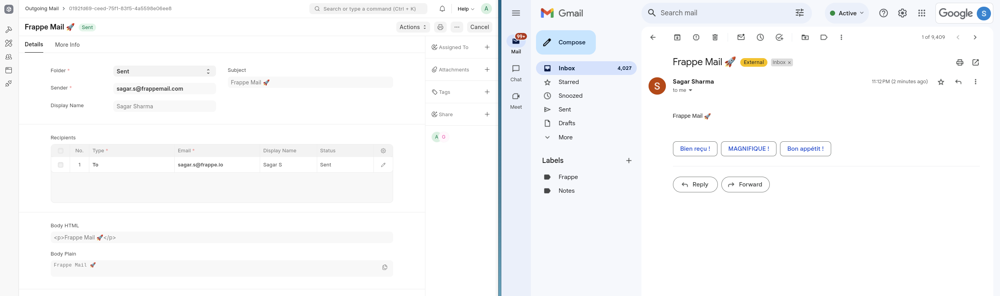

7. **View SMTP Response:** After the email has been sent, you can find the response received from the SMTP server for each recipient in the recipient row. This information will provide insights into the delivery status and any issues encountered during the sending process.

   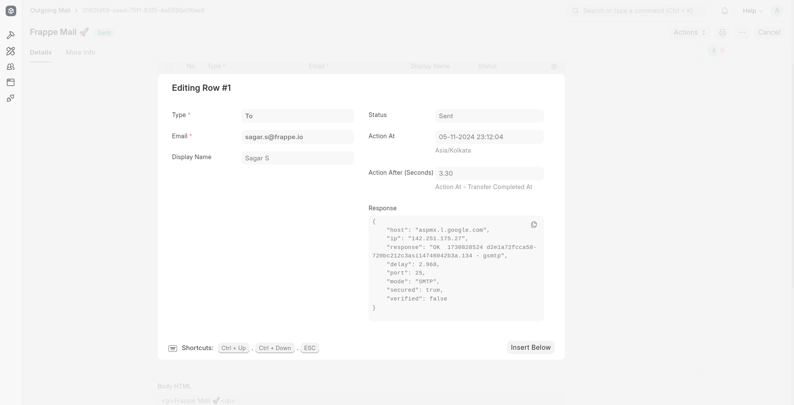

8. **Track Open Status:** If tracking is enabled for the mailbox, you can also view the open status and count of the email. This feature allows you to monitor whether the recipients have opened the email, providing valuable insights into engagement.

   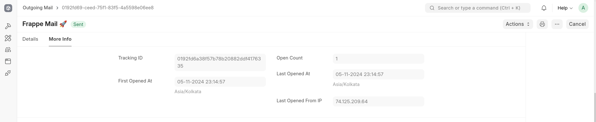

## Outbound Reports

Frappe Mail provides three insightful reports to help you analyze email performance:

1. **Outgoing Mail Summary:** This report displays the total number of sent, bounced, and deferred emails. You can apply various filters to tailor the view to your needs. Additionally, it includes the SMTP responses for all emails, making it a valuable tool for assessing email volume and identifying reasons for any undelivered messages.

   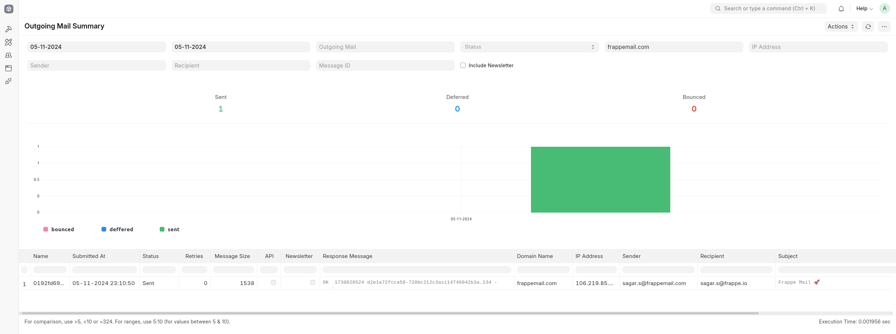

2. **Mail Tracker:** Use this report to monitor emails that have tracking pixels attached. It provides information on how many times these emails have been opened, along with details such as open counts, timestamps, and IP addresses of the recipients.

   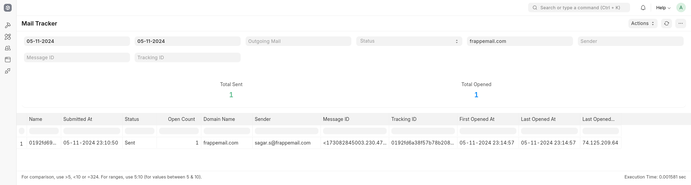

3. **Outbound Delay:** This report tracks the time taken for outgoing emails at different stages, including submission and transfer. It helps you understand where delays may occur in the email sending process.

   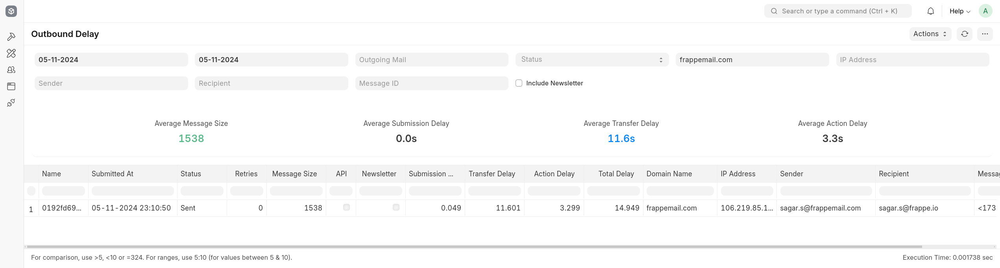

## Receiving Emails

When an email is sent to your registered domains, the Mail Server processes it and transfers it to your Frappe Mail Client after conducting a spam check. The email will be parsed and accepted if the recipient is valid; otherwise, it will be rejected. If the **Send Notification on Reject** option is enabled in the Mail Client Settings, a notification email will be sent to the sender when their email is rejected. Additionally, rejected emails are automatically deleted to conserve storage space, in accordance with the **Rejected Mail Retention** setting.

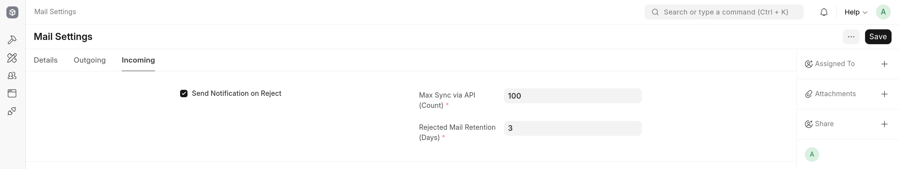

You can view received emails in the **Incoming Mail**, where you will find details about the sender's SMTP server and the time taken at different stages of the email lifecycle. The results of authentication checks such as SPF, DKIM, and DMARC will also be displayed, along with their respective descriptions.

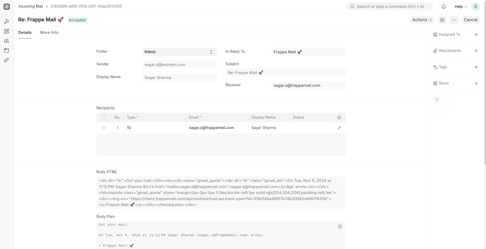

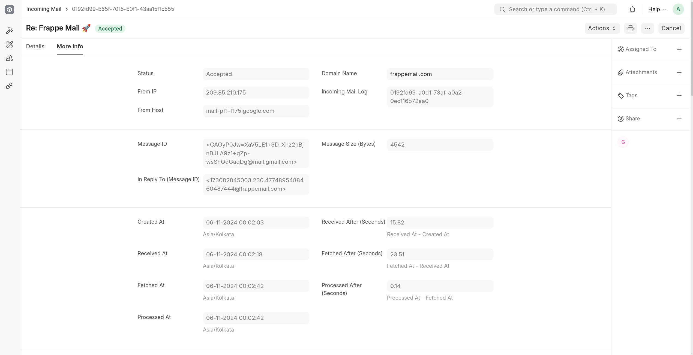

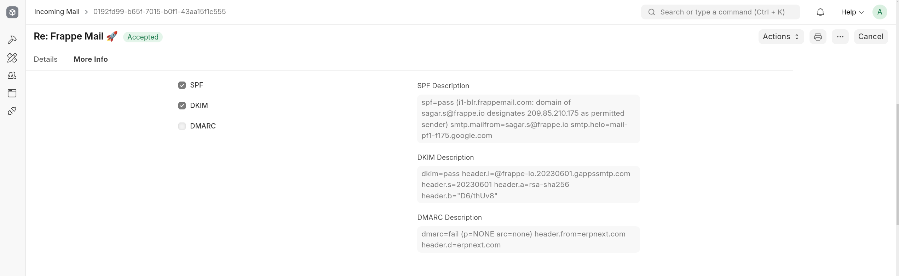

## Mail Aliases

You can create an alias or group to deliver emails to multiple mailboxes. To set up a mail alias, follow these steps:

1. **Go to Mail Alias:** Navigate to the Mail Alias and click on **Add Mail Alias**.

2. **Select Domain Name:** Choose the appropriate domain from the dropdown list.

3. **Set the Alias:** Enter the alias, such as team@frappemail.com.

4. **Select Mailboxes:** Choose the mailbox(es) that you want to receive emails sent to this alias. Ensure that the selected mailboxes have incoming enabled.

5. **Save the Alias:** Click **Save**.

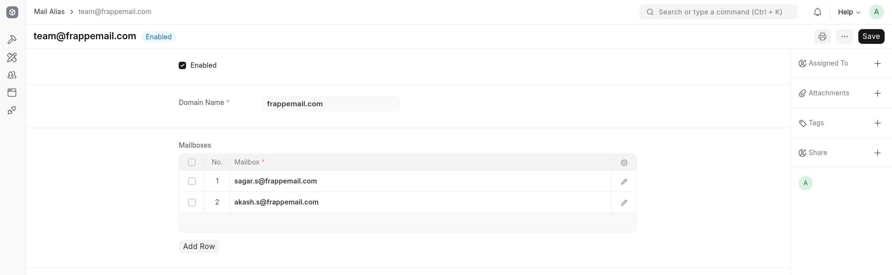

Now, all emails sent to team@frappemail.com will be delivered to the selected mailboxes.

## APIs

### 1. Auth API

#### 1.1 Validate

**Endpoint:** `POST /auth/validate` or `/api/method/mail.api.auth.validate`

**Description:** Validates whether a specific mailbox has permissions for inbound (receiving) or outbound (sending) email functions. Useful for checking mailbox configuration and ensuring that email workflows are properly authorized.

**Parameters:**

- `mailbox` (str | None = None): The mailbox to validate.
- `for_inbound` (bool = False): Set to `True` to validate if the mailbox is configured for inbound emails.
- `for_outbound` (bool = False): Set to `True` to validate if the mailbox is configured for outbound emails.

**Response:** Returns nothing if validation is successful. Throws an exception with the reason if the mailbox cannot be validated.

### 2. Outbound API

These endpoints facilitate sending emails from the Frappe Mail Client.

#### 2.1 Send

**Endpoint:** `POST /outbound/send` or `/api/method/mail.api.outbound.send`

**Description:** Sends an email message with options for attachments, carbon copies (cc), and blind carbon copies (bcc).

**Parameters:**

- `from_` (str): The sender's email address.
- `to` (str | list[str]): Recipient email(s).
- `subject` (str): Subject of the email.
- `cc` (str | list[str] | None): Optional carbon copy recipients.
- `bcc` (str | list[str] | None): Optional blind carbon copy recipients.
- `html` (str | None): Optional HTML body of the email.
- `reply_to` (str | list[str] | None): Optional reply-to email(s).
- `in_reply_to_mail_type` (str | None): Optional reference type for the email being replied to.
- `in_reply_to_mail_name` (str | None): Optional reference ID for the email being replied to.
- `custom_headers` (dict | None): Optional custom headers.
- `attachments` (list[dict] | None): List of attachments.
- `is_newsletter` (bool): Optional flag to mark the email as a newsletter. Defaults to False.

**Response:** Returns a UUID (name) of the created Outgoing Mail.

**Example Response:**

```json
{ "message": "019300a4-91fc-741f-9fe5-9ade8976637f" }
```

#### 2.2 Send Raw

**Endpoint:** `POST /outbound/send-raw` or `/api/method/mail.api.outbound.send_raw`

**Description:** Sends a raw MIME message. This can be useful for users who want to send a preformatted email.

**Parameters:**

- `from_` (str): Sender's email address.
- `to` (str | list[str]): Recipient email(s).
- `raw_message` (str): The complete raw MIME message.
- `is_newsletter` (bool): Optional flag to mark the email as a newsletter. Defaults to False.

**Response:** Returns the UUID (name) of the created Outgoing Mail.

**Example Response:**

```json
{ "message": "019300a4-91fc-741f-9fe5-9ade8976637f" }
```

### 3. Inbound API

These endpoints are for retrieving received emails.

#### 3.1 Pull

**Endpoint:** `GET /inbound/pull` or `/api/method/mail.api.inbound.pull`

**Description:** Fetches a list of received emails for a specified mailbox.

**Parameters:**

- `mailbox` (str): The mailbox from which to pull emails.
- `limit` (int = 50): Maximum number of emails to retrieve.
- `last_synced_at` (str | None): Optional timestamp to fetch emails received after this time.

**Response:** Returns a dictionary with a list of received email details.

**Example Response:**

```json
{
  "message": {
    "mails": [
      {
        "id": "019300b2-c261-71d1-bc8d-bc321cc9ebaf",
        "folder": "Inbox",
        "created_at": "2024-11-06 08:57:26+00:00",
        "subject": "Test Email",
        "html": "<html><body><p>Test Email</p></body></html>",
        "text": "Test Email",
        "reply_to": null,
        "from": "Sagar Sharma <sagar.s@frappemail.com>",
        "to": ["Sagar S <me@s-aga-r.dev>"],
        "cc": []
      }
    ],
    "last_synced_at": "2024-11-06 08:58:55.528916+00:00",
    "last_synced_mail": "019300b2-c261-71d1-bc8d-bc321cc9ebaf"
  }
}
```

#### 3.2 Pull Raw

**Endpoint:** `GET /inbound/pull-raw` or `/api/method/mail.api.inbound.pull_raw`

**Description:** Fetches raw MIME messages for received emails.

**Parameters:** Same as `/inbound/pull`.

**Response:** Returns raw MIME messages.

**Example Response:**

```json
{
  "message": {
    "mails": [
      "Delivered-To: me@s-aga-r.dev\r\nReceived-At: 2024-11-06T08:58:30.063Z\r\nAuthentication-Results: mail.s-aga-r.dev;\r\n\tspf=pass (mail.s-aga-r.dev: domain of sagar.s@frappemail.com designates 64.227.189.58 as permitted sender) smtp.mailfrom=sagar.s@frappemail.com smtp.helo=o1-blr.frappemail.com;\r\n\tdkim=pass header.i=@frappemail.com header.s=frappemail-com-d8852addda header.a=rsa-sha256 header.b=qJlPddwY;\r\n\tdmarc=pass (p=REJECT arc=none) header.from=frappemail.com header.d=frappemail.com;\r\n\tbimi=none\r\nReceived-SPF: pass (mail.s-aga-r.dev: domain of sagar.s@frappemail.com designates 64.227.189.58 as permitted sender) client-ip=64.227.189.58;\r\nReceived: from o1-blr.frappemail.com (o1-blr.frappemail.com [64.227.189.58])\r\n\tby mail.s-aga-r.dev (Haraka/3.0.3) with ESMTPS id EA28E71F-ED28-44DE-86E3-A783E1B759E0.1\r\n\tenvelope-from <sagar.s@frappemail.com>\r\n\ttls TLS_AES_256_GCM_SHA384;\r\n\tWed, 06 Nov 2024 08:58:29 +0000\r\nReceived: (Frappe Mail Agent); Wed, 06 Nov 2024 08:58:29 +0000\r\nReceived: from o1-blr.frappemail.com (ip6-localhost [::1])\r\n\tby o1-blr.frappemail.com (Haraka/3.0.3) with ESMTPSA id BF84C129-A129-4818-88F2-2A216D4D040D.1\r\n\tenvelope-from <sagar.s@frappemail.com>\r\n\ttls TLS_AES_256_GCM_SHA384 (authenticated bits=0);\r\n\tWed, 06 Nov 2024 08:58:29 +0000\r\nContent-Type: multipart/alternative;\r\n boundary=\"===============0863045983596233963==\"\r\nMIME-Version: 1.0\r\nFrom: Sagar Sharma <sagar.s@frappemail.com>\r\nTo: Sagar S <me@s-aga-r.dev>\r\nSubject: Test Email\r\nDate: Wed, 06 Nov 2024 08:57:26 +0000\r\nMessage-ID: <173088344652.222.8316241415157629603@frappemail.com>\r\nX-Priority: 1\r\nDKIM-Signature: v=1; a=rsa-sha256; c=relaxed/simple; d=frappemail.com;\r\n i=@frappemail.com; q=dns/txt; s=frappemail-com-d8852addda; t=1730883446; h=to\r\n : cc : from : date : subject : reply-to : message-id : in-reply-to;\r\n bh=k/MZq04SX5ovIG3cljRzVc8RLJpPS8/IC/KDyuOdV3I=;\r\n b=qJlPddwYBSyHtM/n34p3t3GLjmiHkbANF1m+9m/H4PgHC4LVwtgpS8Yo62uC4T84PoRqZ\r\n h5r+9Vcs/mgXcH2BeMyoqMO4H1Vk6iC6NvEYiHs+iQFjdwgKodpvLuSEls111e6U9+NCybq\r\n OwuDiQ28SiwvmdbVWOrxOACvl4LuJorWdIJ6i5iXelz/f52QMm1tlP2Wh2dXT7Mu6nTGO7g\r\n KpuieIHnDMTurQplxp2dOSnpwsw7I1sr3aHFDyP6oFONzMvTiK+/X2iCMg/W+nMjE4nz+2B\r\n DO7MTGFmB4RsUDyf+HtYVGFe/HggFK6XROWtUJR0CcmWVt9SeK3S5X+OT+tA==\r\nX-FM-OML: 019300b1-f29c-7868-af63-3513911e6801\r\nOriginal-Authentication-Results: o1-blr.frappemail.com;\r\n\tauth=pass (plain)\r\n\r\n--===============0863045983596233963==\r\nContent-Type: text/plain; charset=\"utf-8\"\r\nMIME-Version: 1.0\r\nContent-Transfer-Encoding: base64\r\n\r\nVGVzdCBFbWFpbA==\r\n\r\n--===============0863045983596233963==\r\nContent-Type: text/html; charset=\"utf-8\"\r\nMIME-Version: 1.0\r\nContent-Transfer-Encoding: base64\r\n\r\nPGh0bWw+PGJvZHk+PGltZyBzcmM9Imh0dHBzOi8vY2xpZW50LmZyYXBwZW1haWwuY29tL2FwaS9t\r\nZXRob2QvbWFpbC5hcGkudHJhY2sub3Blbj9pZD0wMTkzMDBiMTY3MjI3MGVjYWE0YWI5OTlmOTBm\r\nMmQ5MCI+PHA+VGVzdCBFbWFpbDwvcD48L2JvZHk+PC9odG1sPg==\r\n\r\n--===============0863045983596233963==--\r\n"
    ],
    "last_synced_at": "2024-11-06 08:58:55.528916+00:00",
    "last_synced_mail": "019300b2-c261-71d1-bc8d-bc321cc9ebaf"
  }
}
```

## Frontend UI

Frappe Mail Client ships with its own frontend UI that can be used for managing emails.

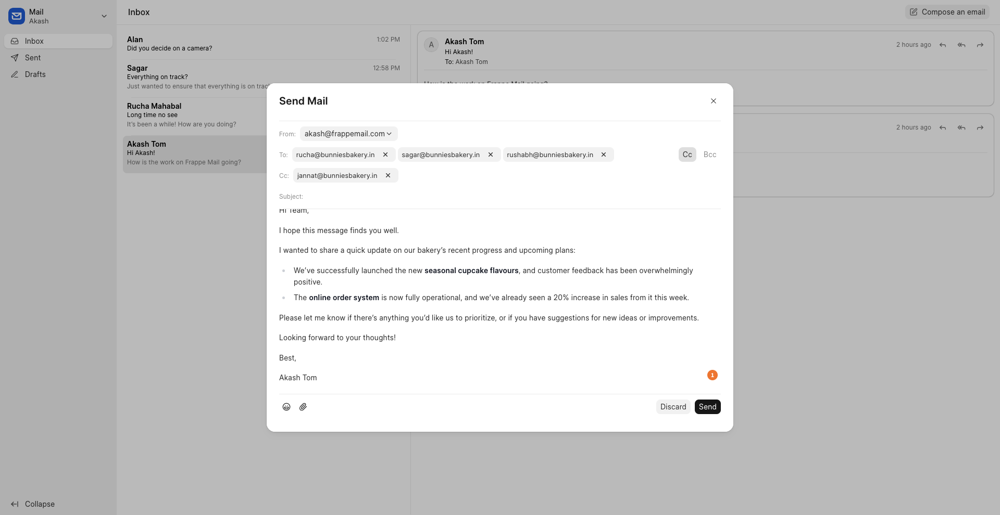

<details>
<summary>More screenshots</summary>

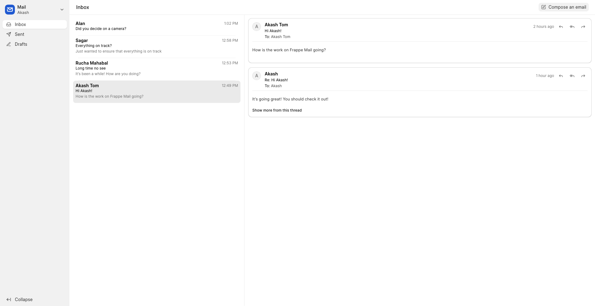

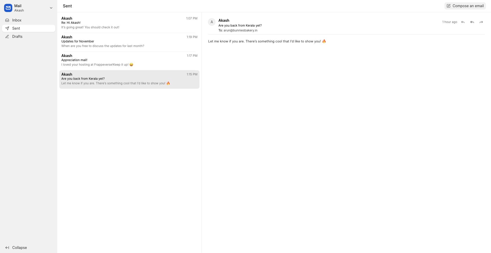

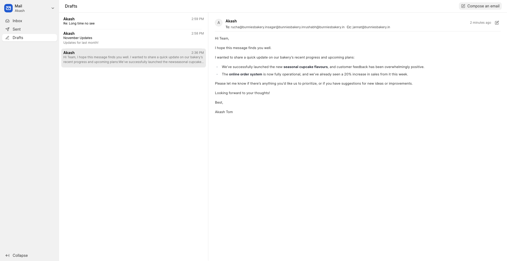

</details>

## Contributing

This app uses `pre-commit` for code formatting and linting. Please [install pre-commit](https://pre-commit.com/#installation) and enable it for this repository:

```bash
cd apps/mail_client
pre-commit install
```

Pre-commit is configured to use the following tools for checking and formatting your code:

- ruff
- eslint
- prettier
- pyupgrade

## License

[GNU Affero General Public License v3.0](https://github.com/frappe/mail_client/blob/develop/license.txt)
