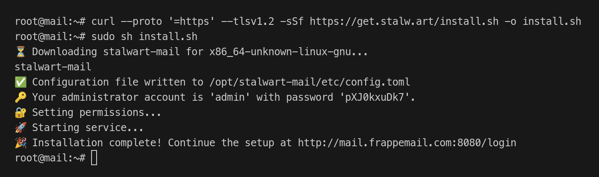
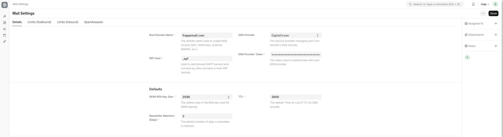

<div align="center" markdown="1">


<h1>Frappe Mail</h1>

**End-to-End Email Management Platform**


</div>

## Frappe Mail

Frappe Mail is a powerful and flexible email management system designed to streamline email communication for businesses. It provides an easy-to-use interface for sending, receiving, and managing email messages, all while ensuring robust security and reliability.

## Table of Contents

- [Introduction](#introduction)
  - [Overview](#overview)
  - [The Role of the Mail Agent](#the-role-of-the-mail-agent)
  - [Key Features](#key-features)
- [Getting Started](#getting-started)
  - [Installation and Setup](#installation-and-setup)
  - [Initial Configuration](#initial-configuration)
  - [Sending Your First Email](#sending-your-first-email)
- [Functionality](#functionality)
  - [Managing Domains, Accounts, Groups, and Aliases](#managing-domains-accounts-groups-and-aliases)
  - [Sending and Receiving Emails](#sending-and-receiving-emails)
  - [Queue Management](#queue-management)
- [APIs](#apis)
  - [Auth](#1-authentication-api)
  - [Outbound](#2-outbound-api)
  - [Inbound](#3-inbound-api)
- [Frontend UI](#frontend-ui)
- [Contributing](#contributing)
- [License](#license)

## Introduction

The introduction provides an overview of the Frappe Mail, its purpose, and the key components that make it a robust email solution for managing communication. This section also offers an insight into the Mail Agent ([Stalwart Mail Server](https://github.com/stalwartlabs/mail-server)), which powers the mail functionalities within the app.

### Overview

Frappe Mail is a comprehensive email management solution integrated with the [Frappe Framework](https://github.com/frappe/frappe), designed to handle a wide range of email-related tasks. It provides users with the tools to send, receive, and manage emails while also offering essential features like email queue management, DKIM signing, and robust reporting. The app can be configured to work with the Mail Agent (Stalwart Mail Server), which handles the actual sending and receiving of emails.

The app is built to scale, offering both simple and advanced features to cater to businesses of all sizes. With its seamless integration within the Frappe ecosystem, administrators and users can manage email settings, troubleshoot email delivery issues, and ensure secure communication between servers.

Key functionalities include:

- SMTP and IMAP connection pooling for efficient email delivery and retrieval.
- Customizable email templates for automated messaging.
- Integration with email security standards like DKIM, SPF, and DMARC.
- Scalable infrastructure for handling high email volumes.

### The Role of the Mail Agent

The Mail Agent (Stalwart Mail Server) is a critical component of the Frappe Mail. It is a dedicated email server designed to handle all email-related communication in an efficient and reliable manner. The Mail Agent ensures the smooth sending and receiving of emails by managing various aspects like SMTP and IMAP connections, message queuing, and DKIM signing.

As a mail server, the Mail Agent manages email transactions by authenticating email accounts, routing messages, and ensuring proper formatting. When a message is sent from the Mail App, the Mail Agent takes care of signing the email (if required), applying security protocols, and delivering the email to its destination.

In summary, the Mail Agent serves the following key roles:

- Handling the sending and receiving of emails via SMTP and IMAP.
- Securing email communication through encryption and DKIM signatures.
- Managing the connection pool for both SMTP and IMAP.
- Supporting high-volume email workflows with efficient queuing mechanisms.

### Key Features

Frappe Mail comes equipped with several key features that make it an indispensable tool for businesses and organizations looking to manage their email operations effectively. These features include:

- **SMTP and IMAP Connection Pooling:** Optimized for handling multiple email connections concurrently, improving overall performance and reducing the load on mail servers.
- **DKIM Signing and Email Security:** Frappe Mail integrates with industry-standard security protocols such as DKIM, SPF, and DMARC, ensuring that emails sent through the system are secure and properly authenticated.
- **Email Queuing and Retry Mechanism:** The Mail App includes an email queuing system to manage outbound messages, with automated retry features to handle transient failures and ensure email delivery.
- **Advanced Reporting and Tracking:** Frappe Mail provides detailed reports on email delivery, bounce rates, and other performance metrics, enabling administrators to troubleshoot and optimize email workflows.
- **Integration with the Frappe Ecosystem:** Seamlessly integrates with other Frappe applications, allowing for centralized management of email, notifications, and other communication tasks.
  With these features, Frappe Mail is not only a powerful solution for managing email communication but also a flexible tool that can be customized to meet the specific needs of businesses, from sending marketing emails to transactional messages and customer support communication.

Comming Soon:

- **Customizable Email Templates:** Users can create and manage dynamic email templates to streamline communication, saving time and ensuring consistency in messaging.

## Getting Started

This section will help you set up and configure Frappe Mail, ensuring that your email system is ready to use. It includes instructions for installing both the Stalwart Mail Server and the Frappe Mail app, details about system requirements, and steps for the initial configuration.

### Installation and Setup

Follow these steps to install and set up Frappe Mail and its supporting components:

#### Step 1: Install and Configure Stalwart Mail Server

The Stalwart Mail Server is the backbone of Frappe Mail's functionality. Below are the instructions for setting up Stalwart for both development and production environments.

**Development**

Install the Stalwart Mail Server using the official [installation guide](https://stalw.art/docs/category/installation) or by running the following commands:

```bash
  curl --proto '=https' --tlsv1.2 -sSf https://get.stalw.art/install.sh -o install.sh
  sudo sh install.sh
```



**Production**

Setting up Stalwart Mail Server for production requires additional configurations, such as DNS and TLS settings.

1. **Set Up a Pointer or Reverse DNS Record (rDNS):**
   Configure your mail server's pointer or rDNS record to match the Fully Qualified Domain Name (FQDN). Refer to the documentation of your provider.

2. **Install Stalwart Mail Server:**
   SSH into your VPS as the root user and install Stalwart using the following commands:

   ```bash
     curl --proto '=https' --tlsv1.2 -sSf https://get.stalw.art/install.sh -o install.sh
     sudo sh install.sh
   ```

3. **Login to the Stalwart Admin Panel:**
   Access your Stalwart Mail Server using the administrator credentials provided after installation.

4. **Set Hostname:**
   Navigate to **Network Settings** in the Stalwart admin panel and configure the hostname to your FQDN.
   

5. **Configure TLS Certificates:**

   - Go to **Server > TLS > ACME Providers** and create a new provider.
     
   - Alternatively, add your existing TLS certificates.

6. **Restart the Stalwart Mail Server:**
   Apply the changes by restarting the server:

   ```bash
     sudo systemctl restart stalwart-mail
   ```

#### Step 2: Install Frappe Mail

After setting up the Stalwart Mail Server, the next step is to install the Frappe Mail app. You can choose between using Docker for an easy setup or performing a manual installation.

**Using Docker**

1. **Download the** `docker-compose.yml` **file:**

   ```bash
   wget -O docker-compose.yml https://raw.githubusercontent.com/frappe/mail/develop/docker/docker-compose.yml
   ```

2. **Download the setup script:**

   ```bash
   wget -O init.sh https://raw.githubusercontent.com/frappe/mail/develop/docker/init.sh
   ```

3. **Run the container in detached mode:**

   ```bash
   docker compose up -d
   ```

4. **Access the Frappe Mail site:**
   Visit http://mail.localhost in your browser.

   **Default Credentials:**

   - **Username:** `administrator`
   - **Password:** `admin`

**Manual Installation**

1. **Prerequisite:**
   Ensure that the [Frappe Bench](https://github.com/frappe/bench) is installed and running on your system.
   If not, refer to the [Frappe installation guide](https://docs.frappe.io/framework/user/en/installation) for detailed steps.

1. **Install the Mail App and Create a Site:**
   Run the following commands to install the Mail app and set up a new Frappe site:

   ```bash
     bench get-app mail
     bench new-site mail.localhost --install-app mail
     bench browse mail.localhost --user Administrator
   ```

### Initial Configuration

After successfully installing Frappe Mail, follow these steps to configure your email system. This involves setting up DNS records, connecting the Mail Agent (Stalwart Mail Server), and creating domains and accounts.

#### Step 1: Configure Mail Settings

1. **Set Root Domain Name:**

   - Navigate to **Mail Settings** and define the Root Domain Name.
   - This Root Domain is critical for configuring DNS records, such as Root SPF, DKIM keys, and the external DMARC record.

   

2. **Configure DNS Provider (Optional):**

   - If you are using **DigitalOcean** as your DNS provider, enable its integration in Mail Settings. This will automate the creation of server DNS records.
   - If you use another DNS provider, you'll need to manually create the required DNS records.

   **_Note:_** Currently, only DigitalOcean integration is supported, but additional DNS providers will be added in future updates.

3. **Set Outbound and Inbound Limits (Optional):**

   - Define email outbound and inbound limits based on your requirements or the configurations of your Stalwart Mail Server.

   
   

#### Step 2: Add Mail Agent

To connect Frappe Mail with the Stalwart Mail Server(s), configure Mail Agents and Mail Agent Groups.

1. **Create a Mail Agent Group:**

   - Go to **Mail Agent Group** and create a new Mail Agent Group.
   - Each Mail Agent must belong to a group, which helps manage multiple agents.
     - **MX Records:** Generated based on enabled inbound Mail Agent Groups for Mail Domains.
     - **Root SPF Record:** Automatically created/updated to include enabled outbound Mail Agents.
   - For a single Stalwart instance:
     - Use its **hostname** as the Mail Agent Group host.
     - For locally installed Stalwart, use **localhost**.

   

2. **Add a Mail Agent:**

   - Navigate to **Mail Agent** and create a new Mail Agent.
   - Select the Mail Agent Group created in the previous step.
   - Provide either:
     - **API Key:** Add it directly.
     - **Username and Password:** The system will generate an API Key automatically.

   

3. **Verify and Update DNS Records:**

   - When a Agent or Agent Group is added, necessary DNS records are created or updated.
   - If a DNS provider is not configured, manually add or update the DNS records with your domain registrar.

     

#### Step 3: Add Mail Domains

1. Navigate to the **Mail Domain** and create a new domain or subdomain from which you want to send emails.
2. Upon adding a domain, a list of required DNS records (SPF, DKIM, DMARC, etc.) will be displayed. Add these records to your domain registrar.
3. After updating the DNS records, verify them:
   - Click **Actions > Verify DNS Records** to ensure proper configuration.
4. Repeat this process to add additional domains as needed.


#### Step 4: Add Mail Accounts

1. Go to the **Mail Account** and create a new Mail Account.
2. Assign the following:
   - **Domain:** Select one of the domains configured in the previous step.
   - **User:** Choose the user (with the Mail User role) to whom this account will belong.
3. Save the document, and repeat the process for any additional accounts.


### Sending Your First Email

Frappe Mail offers three simple ways to send emails:

1. **Using the Mail UI**
2. **Through the Desk Interface**
3. **Via APIs**

#### 1. Sending Emails from the Mail UI

- Go to the Mail UI at `/mail`.
- Click the **Compose** button to open the email editor.
- Fill in the recipient's address, email subject, and message body.
- Click **Send** to deliver your email.


#### 2. Sending Emails from the Desk Interface

- Navigate to the **Outgoing Mail**.
- Create a new document, then add the email subject, body, and recipients.
- Save and submit the document to send the email.


**_Note:_** This method requires manually adding HTML content, as it does not include a rich text editor.

#### 3. Sending Emails via APIs

- For programmatic email sending, refer to the [Outbound API](#2-outbound-api) section in the documentation.

With these options, you can choose the method that best suits your workflow or automation needs.

## Functionality

This section explains the core functionalities of Frappe Mail, including how to manage domains, accounts, groups, and aliases, as well as how to send and receive emails. It also covers the management of email queues for efficient processing.

### Managing Domains, Accounts, Groups, and Aliases

Frappe Mail provides an easy-to-use interface for managing the various components of your email system. Here's how you can set up and manage each of these elements:

#### Domains:

- A domain represents your email domain (e.g., example.com) and is used to define the sending and receiving email addresses.
- You can add, remove, and configure multiple domains in Frappe Mail. Each domain must be verified and associated with the appropriate MX, SPF, and DKIM records to ensure email deliverability and security.

#### Accounts:

- An mail account in Frappe Mail is associated with a user (with Mail User role) (e.g., user@example.com).
- You can create accounts manually through the desk, and assign roles and permissions to manage who can send and receive emails.

#### Groups:

- Mail groups allow you to organize multiple email accounts under one entity. These are useful for managing shared email addresses or sending emails to a group of recipients.
- You can create and manage groups within the app and assign members to each group.
- A group can also have a group as a member, allowing for nested group structures.

#### Aliases:

- Aliases are alternative email addresses for existing accounts or group (e.g., sale@example.com could be an alias for sales@example.com).
- Aliases can be managed and configured to forward incoming emails to the main account or to a group.

### Sending and Receiving Emails

Frappe Mail simplifies the process of sending and receiving emails through its seamless integration with the Mail Agent (Stalwart Mail Server). Here's how it works:

#### Sending Emails:

- To send an email, Frappe Mail connects to the SMTP server through the configured Mail Agent.
- When a user sends an email, Frappe Mail retrieves an available connection from the SMTP pool. If no connection is available, a new one is created.
- The email is then processed, and if necessary, additional operations such as DKIM signing are performed before sending the email through the Mail Agent to the recipient's mail server.

#### Receiving Emails:

- Frappe Mail also manages the IMAP connection for receiving emails. It connects to the configured IMAP server and periodically checks for new emails.
- Once an email is received, it is stored in the user's inbox/spam folder based on the email's classification.
- Users can access their received emails through the app’s inbox interface, and emails can be organized into folders or marked with labels as needed.

### Queue Management

Frappe Mail uses a queueing system to manage the sending and receiving of emails efficiently. This ensures that email traffic is processed in a timely manner without overloading the system.

#### Email Queue for Outbound Emails:

- Emails are placed in a queue before being sent out. This allows the system to manage high volumes of outgoing emails by ensuring that they are sent in a order.
- The queue can be monitored and managed, and administrators can control the maximum number of concurrent connections to the mail server for optimized performance.

#### Inbound Email Queue:

Similarly, inbound emails are placed in a queue for processing. This allows Frappe Mail to handle large volumes of incoming emails and ensures that each email is processed properly, including filtering, categorization, and delivery to the appropriate inbox.

#### Error Handling:

- If there’s an error while sending or receiving an email, it is placed in a separate error queue. Administrators can review these emails and resolve any issues that might have caused the failure (e.g., connection issues, invalid credentials, etc.).

Queue management ensures that emails are processed efficiently, even under high load, and provides the necessary tools for administrators to keep track of all email activity.

## APIs

### 1. Authentication API

#### 1.1 Validate

- **Endpoint:** `POST /auth/validate` or `/api/method/mail.api.auth.validate`
- **Description:** Validates if a user has the required permissions for an account.
- **Parameters:**
  - `account` (str | None = None): The account to validate.
- **Response:** Returns nothing if validation is successful. Throws an exception with the reason if the account cannot be validated.

### 2. Outbound API

APIs for sending emails through Frappe Mail.

#### 2.1 Send

- **Endpoint:** `POST /outbound/send` or `/api/method/mail.api.outbound.send`
- **Description:** Sends an email message with options for attachments, carbon copies (cc), and blind carbon copies (bcc).
- **Parameters:**
  - `from_` (str): The sender's email address.
  - `to` (str | list[str]): Recipient email(s).
  - `subject` (str): Subject of the email.
  - `cc` (str | list[str] | None): Optional carbon copy recipients.
  - `bcc` (str | list[str] | None): Optional blind carbon copy recipients.
  - `html` (str | None): Optional HTML body of the email.
  - `reply_to` (str | list[str] | None): Optional reply-to email(s).
  - `in_reply_to_mail_type` (str | None): Optional reference type for the email being replied to.
  - `in_reply_to_mail_name` (str | None): Optional reference ID for the email being replied to.
  - `custom_headers` (dict | None): Optional custom headers.
  - `attachments` (list[dict] | None): List of attachments.
  - `is_newsletter` (bool): Optional flag to mark the email as a newsletter. Defaults to False.
- **Response:** Returns a UUID (name) of the created Outgoing Mail.
- **Example Response:**
  ```json
  { "message": "019300a4-91fc-741f-9fe5-9ade8976637f" }
  ```

#### 2.2 Send Raw

- **Endpoint:** `POST /outbound/send-raw` or `/api/method/mail.api.outbound.send_raw`
- **Description:** Sends a raw MIME message. This can be useful for users who want to send a preformatted email.
- **Parameters:**
  - `from_` (str): Sender's email address.
  - `to` (str | list[str]): Recipient email(s).
  - `raw_message` (str): The complete raw MIME message.
  - `is_newsletter` (bool): Optional flag to mark the email as a newsletter. Defaults to False.
- **Response:** Returns the UUID (name) of the created Outgoing Mail.
- **Example Response:**
  ```json
  { "message": "019300a4-91fc-741f-9fe5-9ade8976637f" }
  ```

### 3. Inbound API

APIs for retrieving received emails.

#### 3.1 Pull

- **Endpoint:** `GET /inbound/pull` or `/api/method/mail.api.inbound.pull`
- **Description:** Fetches a list of received emails for a specified account.
- **Parameters:**
  - `account` (str): The account from which to pull emails.
  - `limit` (int = 50): Maximum number of emails to retrieve.
  - `last_synced_at` (str | None): Optional timestamp to fetch emails received after this time.
- **Response:** Returns a dictionary with a list of received email details.
- **Example Response:**
  ```json
  {
    "message": {
      "mails": [
        {
          "id": "019300b2-c261-71d1-bc8d-bc321cc9ebaf",
          "folder": "Inbox",
          "created_at": "2024-11-06 08:57:26+00:00",
          "subject": "Test Email",
          "html": "<html><body><p>Test Email</p></body></html>",
          "text": "Test Email",
          "reply_to": null,
          "from": "Sagar Sharma <sagar.s@frappemail.com>",
          "to": ["Sagar S <me@s-aga-r.dev>"],
          "cc": []
        }
      ],
      "last_synced_at": "2024-11-06 08:58:55.528916+00:00",
      "last_synced_mail": "019300b2-c261-71d1-bc8d-bc321cc9ebaf"
    }
  }
  ```

#### 3.2 Pull Raw

- **Endpoint:** `GET /inbound/pull-raw` or `/api/method/mail.api.inbound.pull_raw`
- **Description:** Fetches raw MIME messages for received emails.
- **Parameters:** Same as `/inbound/pull`.
- **Response:** Returns raw MIME messages.
- **Example Response:**
  ```json
  {
    "message": {
      "mails": [
        "Delivered-To: me@s-aga-r.dev\r\nReceived-At: 2024-11-06T08:58:30.063Z\r\nAuthentication-Results: mail.s-aga-r.dev;\r\n\tspf=pass (mail.s-aga-r.dev: domain of sagar.s@frappemail.com designates 64.227.189.58 as permitted sender) smtp.mailfrom=sagar.s@frappemail.com smtp.helo=o1-blr.frappemail.com;\r\n\tdkim=pass header.i=@frappemail.com header.s=frappemail-com-d8852addda header.a=rsa-sha256 header.b=qJlPddwY;\r\n\tdmarc=pass (p=REJECT arc=none) header.from=frappemail.com header.d=frappemail.com;\r\n\tbimi=none\r\nReceived-SPF: pass (mail.s-aga-r.dev: domain of sagar.s@frappemail.com designates 64.227.189.58 as permitted sender) client-ip=64.227.189.58;\r\nReceived: from o1-blr.frappemail.com (o1-blr.frappemail.com [64.227.189.58])\r\n\tby mail.s-aga-r.dev (Haraka/3.0.3) with ESMTPS id EA28E71F-ED28-44DE-86E3-A783E1B759E0.1\r\n\tenvelope-from <sagar.s@frappemail.com>\r\n\ttls TLS_AES_256_GCM_SHA384;\r\n\tWed, 06 Nov 2024 08:58:29 +0000\r\nReceived: (Frappe Mail Agent); Wed, 06 Nov 2024 08:58:29 +0000\r\nReceived: from o1-blr.frappemail.com (ip6-localhost [::1])\r\n\tby o1-blr.frappemail.com (Haraka/3.0.3) with ESMTPSA id BF84C129-A129-4818-88F2-2A216D4D040D.1\r\n\tenvelope-from <sagar.s@frappemail.com>\r\n\ttls TLS_AES_256_GCM_SHA384 (authenticated bits=0);\r\n\tWed, 06 Nov 2024 08:58:29 +0000\r\nContent-Type: multipart/alternative;\r\n boundary=\"===============0863045983596233963==\"\r\nMIME-Version: 1.0\r\nFrom: Sagar Sharma <sagar.s@frappemail.com>\r\nTo: Sagar S <me@s-aga-r.dev>\r\nSubject: Test Email\r\nDate: Wed, 06 Nov 2024 08:57:26 +0000\r\nMessage-ID: <173088344652.222.8316241415157629603@frappemail.com>\r\nX-Priority: 1\r\nDKIM-Signature: v=1; a=rsa-sha256; c=relaxed/simple; d=frappemail.com;\r\n i=@frappemail.com; q=dns/txt; s=frappemail-com-d8852addda; t=1730883446; h=to\r\n : cc : from : date : subject : reply-to : message-id : in-reply-to;\r\n bh=k/MZq04SX5ovIG3cljRzVc8RLJpPS8/IC/KDyuOdV3I=;\r\n b=qJlPddwYBSyHtM/n34p3t3GLjmiHkbANF1m+9m/H4PgHC4LVwtgpS8Yo62uC4T84PoRqZ\r\n h5r+9Vcs/mgXcH2BeMyoqMO4H1Vk6iC6NvEYiHs+iQFjdwgKodpvLuSEls111e6U9+NCybq\r\n OwuDiQ28SiwvmdbVWOrxOACvl4LuJorWdIJ6i5iXelz/f52QMm1tlP2Wh2dXT7Mu6nTGO7g\r\n KpuieIHnDMTurQplxp2dOSnpwsw7I1sr3aHFDyP6oFONzMvTiK+/X2iCMg/W+nMjE4nz+2B\r\n DO7MTGFmB4RsUDyf+HtYVGFe/HggFK6XROWtUJR0CcmWVt9SeK3S5X+OT+tA==\r\nX-FM-OML: 019300b1-f29c-7868-af63-3513911e6801\r\nOriginal-Authentication-Results: o1-blr.frappemail.com;\r\n\tauth=pass (plain)\r\n\r\n--===============0863045983596233963==\r\nContent-Type: text/plain; charset=\"utf-8\"\r\nMIME-Version: 1.0\r\nContent-Transfer-Encoding: base64\r\n\r\nVGVzdCBFbWFpbA==\r\n\r\n--===============0863045983596233963==\r\nContent-Type: text/html; charset=\"utf-8\"\r\nMIME-Version: 1.0\r\nContent-Transfer-Encoding: base64\r\n\r\nPGh0bWw+PGJvZHk+PGltZyBzcmM9Imh0dHBzOi8vY2xpZW50LmZyYXBwZW1haWwuY29tL2FwaS9t\r\nZXRob2QvbWFpbC5hcGkudHJhY2sub3Blbj9pZD0wMTkzMDBiMTY3MjI3MGVjYWE0YWI5OTlmOTBm\r\nMmQ5MCI+PHA+VGVzdCBFbWFpbDwvcD48L2JvZHk+PC9odG1sPg==\r\n\r\n--===============0863045983596233963==--\r\n"
      ],
      "last_synced_at": "2024-11-06 08:58:55.528916+00:00",
      "last_synced_mail": "019300b2-c261-71d1-bc8d-bc321cc9ebaf"
    }
  }
  ```

## Frontend UI

Frappe Mail ships with its own frontend UI that can be used for managing emails.


<details>
<summary>More screenshots</summary>


</details>

## Contributing

This app uses `pre-commit` for code formatting and linting. Please [install pre-commit](https://pre-commit.com/#installation) and enable it for this repository:

```bash
cd apps/mail
pre-commit install
```

Pre-commit is configured to use the following tools for checking and formatting your code:

- ruff
- eslint
- prettier
- pyupgrade

## License

[GNU Affero General Public License v3.0](https://github.com/frappe/mail/blob/develop/license.txt)

<br/>
<br/>
<div align="center" style="padding-top: 0.75rem;">
	<a href="https://frappe.io" target="_blank">
		<picture>
			<source media="(prefers-color-scheme: dark)" srcset="https://frappe.io/files/Frappe-white.png">
			
		</picture>
	</a>
</div>
